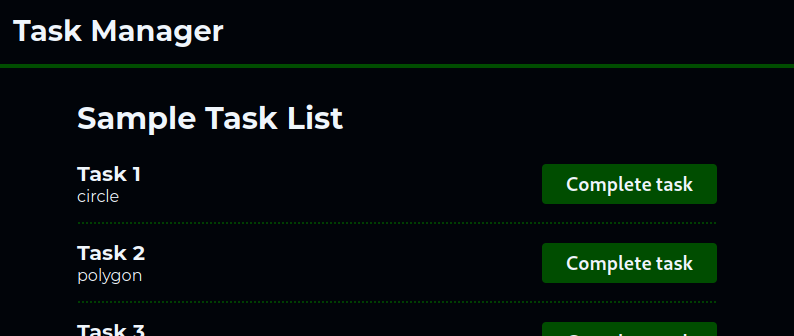

# task-manager
This is a task manager application built for a Vue 3 exercise. It includes 
- Backend: Node.js (Fastify)
- Frontend: Vue 3 (with Pinia, Vitest)
- Proxy: Nginx



## Prerequisites
- Docker Compose
- Node.js (version >=23)
    - The latest version of Node.js can run TypeScript files natively. It is
      still marked as experimental, though.
- [just](https://github.com/casey/just) command runner (optional)

## Install
Run the bootstrap script in the project root. It sets up the `.env` files and 
installs the dependencies:
```
./bootstrap.sh
```

## Running locally
If you have [just](https://github.com/casey/just) installed, you can start the
services simply by running:
```
just dev
```

Alternatively, you can start the services with Compose directly:
```
docker compose --profile dev up
```

Open `http://localhost/` in your web browser and you should see the app.

Check the [justfile](./justfile) in the repository for more commands.

### Without Docker
If you don't want to use Docker, you can start the app manually too:
1. Edit `./frontend/.env` to have `VITE_API_URL=http://localhost:8080`.
2. Start the backend in `./backend`:
```
npm run dev
```
3. Start the frontend in `./frontend`:
```
npm run dev
```
4. Open `http://localhost:5173` in your web browser and you should see the app.

## Running tests
The repository includes unit tests for the frontend. You can run them with:
```
just test
```

Or alternatively:
```
cd ./frontend/
npm run test:unit
```
